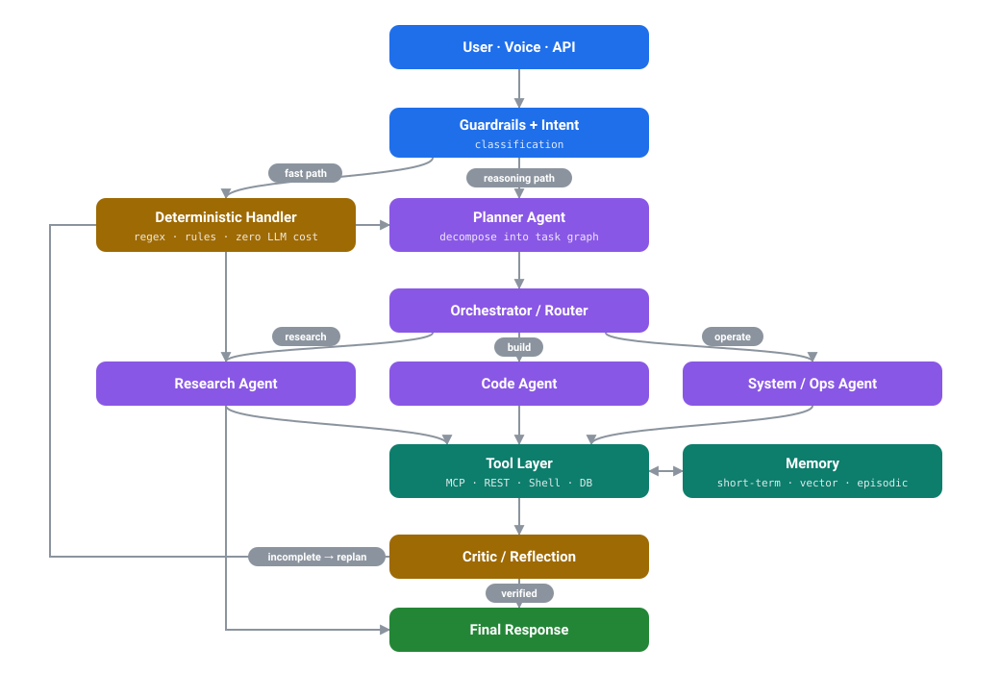

<div align="center">


<a href="https://github.com/DharamVeer970">

</a>

<br/>

<a href="https://www.linkedin.com/in/dharam-veer-657711226/"></a>
<a href="mailto:dharamveeer4@gmail.com"></a>

<a href="https://github.com/DharamVeer970?tab=followers"></a>

</div>

---

## `>` Whoami

```text
$ agent.invoke("who is dharam veer?")

  planner      → decompose(query) ................... 4 subtasks
  retriever    → scan(github, projects, shipped) .... 20 repos
  synthesizer  → build_profile() .................... ok

╭──────────────────────────────────────────────────────────────╮
│  name       Dharam Veer                                      │
│  role       Agentic AI Engineer · AI Automation Builder      │
│  builds     multi-agent systems, tool-calling runtimes,      │
│             memory-backed workflows, MCP integrations        │
│  stack      Python · LangGraph · FastAPI · MCP · OpenAI      │
│  shipping   Wilco — voice agent for Windows, 64 tools        │
│  belief     an agent is only as good as its tool layer       │
╰──────────────────────────────────────────────────────────────╯

✔ 3 steps · 0 hallucinations · returning control to user
```

---

## `>` Featured work

### 🎙️ Wilco — Voice-Controlled Agent for Windows

> Speak to your machine, it acts. Whisper transcribes, an agent loop reasons, **64 tools** touch the real OS.

Not a wrapper around a chat API — a full agent runtime with two execution paths, a safety gate, and real system access.

| | |
|---|---|
| **Dual execution** | Instant regex path for common commands, full tool-calling agent loop for everything else — so trivial requests never pay LLM latency |
| **64 tools** | App control, file ops, PowerShell, web search, email, messaging, window management |
| **Provider-agnostic** | Cohere, OpenAI, Anthropic, Groq, HuggingFace, Ollama — swapped by config, not code |
| **MCP server** | Exposes its own toolset over Model Context Protocol to Claude Desktop and other clients |
| **Safety gates** | Confirmation required before destructive actions — delete, shutdown, send |
| **Context aware** | Tracks recent searches, active apps, and working directories across turns |

<a href="https://github.com/DharamVeer970/Wilco"></a>


<br/>

### Also building

| Project | What it does | Stack |
|---|---|---|
| **Trading Agent** `private` | Autonomous market-analysis agent — signal ingestion, LLM reasoning over indicators, decision logging | Python · LLM tool calling |
| [**Cancer Treatment ML**](https://github.com/DharamVeer970/Cancer_treatment_Project) | Classification pipeline for treatment outcome prediction — preprocessing, training, evaluation | scikit-learn · Jupyter |
| [**Stock Management System**](https://github.com/DharamVeer970/Stock_management_system) | Inventory tracking with full CRUD and persistent storage | Python · SQL |
| [**ChatGPT Clone**](https://github.com/DharamVeer970/Chatgpt-Clone) | Conversational UI with streaming responses and chat persistence | JS · OpenAI API |
| [**House Price Prediction**](https://github.com/DharamVeer970/House_Price_Prediction) | Regression modelling with feature engineering and error analysis | pandas · scikit-learn |
| [**Wine Quality Prediction**](https://github.com/DharamVeer970/Wine_Quality_Prediction) | Multi-class classification on physicochemical features | pandas · scikit-learn |

---

## `>` How I architect agents

Every system I build follows the same spine: **plan → route → act → remember → critique → repeat.**
The critic loop is the part most "AI apps" skip — and it's the reason they break in production.

<div align="center">



</div>

---

## `>` Tech arsenal

<details open>
<summary><b>🤖 Agentic AI &amp; LLM</b></summary>
<br/>


`tool calling` · `function schemas` · `RAG` · `agent memory` · `multi-agent routing` · `reflection loops` · `prompt engineering`

</details>

<details>
<summary><b>⚙️ Backend &amp; APIs</b></summary>
<br/>


</details>

<details>
<summary><b>📊 Data &amp; Machine Learning</b></summary>
<br/>


</details>

<details>
<summary><b>🎨 Frontend</b></summary>
<br/>


</details>

<details>
<summary><b>🗄️ Data Stores &amp; Tooling</b></summary>
<br/>


</details>

---

## `>` By the numbers

<div align="center">

<!-- Flagship repo: DharamVeer970/Wilco. Its name is baked into the badge URLs
     below and into the language row further down. Renaming the repo means
     updating every one of those URLs together. -->


<br/><br/>

<picture>
  <source media="(prefers-color-scheme: dark)" srcset="https://streak-stats.demolab.com?user=DharamVeer970&hide_border=true&background=0d1117&stroke=30363d&ring=8957e5&fire=1f6feb&currStreakLabel=8957e5&sideLabels=c9d1d9&dates=8b949e&currStreakNum=c9d1d9&sideNums=c9d1d9" />
  
</picture>

<br/><br/>

<sub><b>PRIMARY LANGUAGE PER PROJECT</b> — read live from the GitHub API</sub>

<br/>

<a href="https://github.com/DharamVeer970/Wilco"></a>
<a href="https://github.com/DharamVeer970/Cancer_treatment_Project"></a>
<a href="https://github.com/DharamVeer970/Stock_management_system"></a>
<a href="https://github.com/DharamVeer970/Chatgpt-Clone"></a>
<a href="https://github.com/DharamVeer970/House_Price_Prediction"></a>
<a href="https://github.com/DharamVeer970/Wine_Quality_Prediction"></a>

<br/><br/>

<picture>
  <source media="(prefers-color-scheme: dark)" srcset="https://github-readme-activity-graph.vercel.app/graph?username=DharamVeer970&theme=github-compact&bg_color=0d1117&color=c9d1d9&line=8957e5&point=1f6feb&area=true&hide_border=true" />
  
</picture>

<picture>
  <source media="(prefers-color-scheme: dark)" srcset="https://github-profile-summary-cards.vercel.app/api/cards/profile-details?username=DharamVeer970&theme=github_dark" />
  
</picture>

</div>

---

## `>` Live agent log

> This block isn't hand-written. A scheduled agent ([`scripts/profile_agent.py`](scripts/profile_agent.py))
> wakes up daily, queries the GitHub API, and rewrites everything between the markers below —
> then commits only if something actually changed. My README maintains itself.

<!-- AGENT-LOG:START -->

### 🔦 Currently in the workshop — [`Wilco`](https://github.com/DharamVeer970/Wilco)

> Voice agent for Windows: Whisper STT, an instant regex command path, and a 39-tool agent loop that controls apps, files, settings and PowerShell.

`Python` · updated 7h ago

### 📡 Recent signals

| when | what |
|:--|:--|
| `2w ago` | branched `main` on [`Wilco`](https://github.com/DharamVeer970/Wilco) |

### 🧬 What I actually write

<sub>share of public projects by primary language</sub>

```text
Jupyter Notebook  ███████████░░░░░░░░░░░░░░░░░░░░░░░   33.3%  5 projects
HTML              █████████░░░░░░░░░░░░░░░░░░░░░░░░░   26.7%  4 projects
Python            █████░░░░░░░░░░░░░░░░░░░░░░░░░░░░░   13.3%  2 projects
Java              █████░░░░░░░░░░░░░░░░░░░░░░░░░░░░░   13.3%  2 projects
JavaScript        ██░░░░░░░░░░░░░░░░░░░░░░░░░░░░░░░░    6.7%  1 project
CSS               ██░░░░░░░░░░░░░░░░░░░░░░░░░░░░░░░░    6.7%  1 project
```

<div align="right">

<sub>🤖 generated by <code>profile_agent.py</code> · 20 public repos · last run 21 Aug 2026 · 03:16 UTC</sub>

</div>

<!-- AGENT-LOG:END -->

---

## `>` What's next

```yaml
now:
  - Wilco v2 — parallel tool execution + streaming voice responses
  - Multi-agent orchestrator with shared episodic memory
  - Publishing reusable MCP servers for local system control

learning:
  - Agent evaluation: how do you unit-test something non-deterministic?
  - Long-horizon memory — compaction, retrieval, forgetting
  - Cost-aware routing: cheapest model that still gets it right

open_to:
  - Agentic AI / LLM engineering roles
  - Collaborations on open-source agent tooling
```

---

## `>` Contribution graph, eaten

<div align="center">

<picture>
  <source media="(prefers-color-scheme: dark)" srcset="https://raw.githubusercontent.com/DharamVeer970/DharamVeer970/output/github-snake-dark.svg" />
  <source media="(prefers-color-scheme: light)" srcset="https://raw.githubusercontent.com/DharamVeer970/DharamVeer970/output/github-snake.svg" />
  
</picture>

</div>

---

<div align="center">

## `>` Let's build something autonomous

<a href="mailto:dharamveeer4@gmail.com"></a>
<a href="https://www.linkedin.com/in/dharam-veer-657711226/"></a>
<a href="https://github.com/DharamVeer970"></a>

<br/><br/>

**⭐ Anything here useful? A star helps more than you'd think.**


</div>
